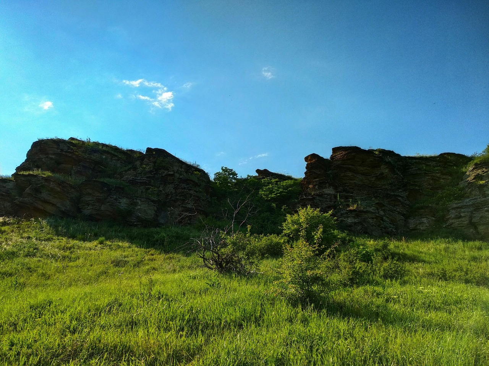
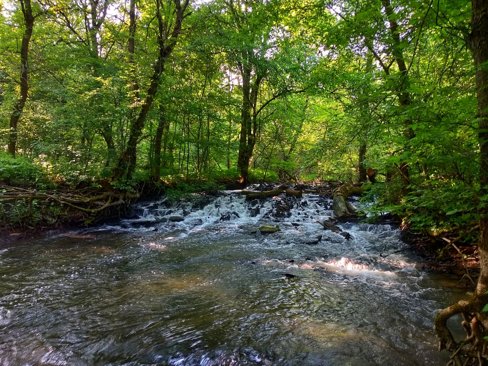
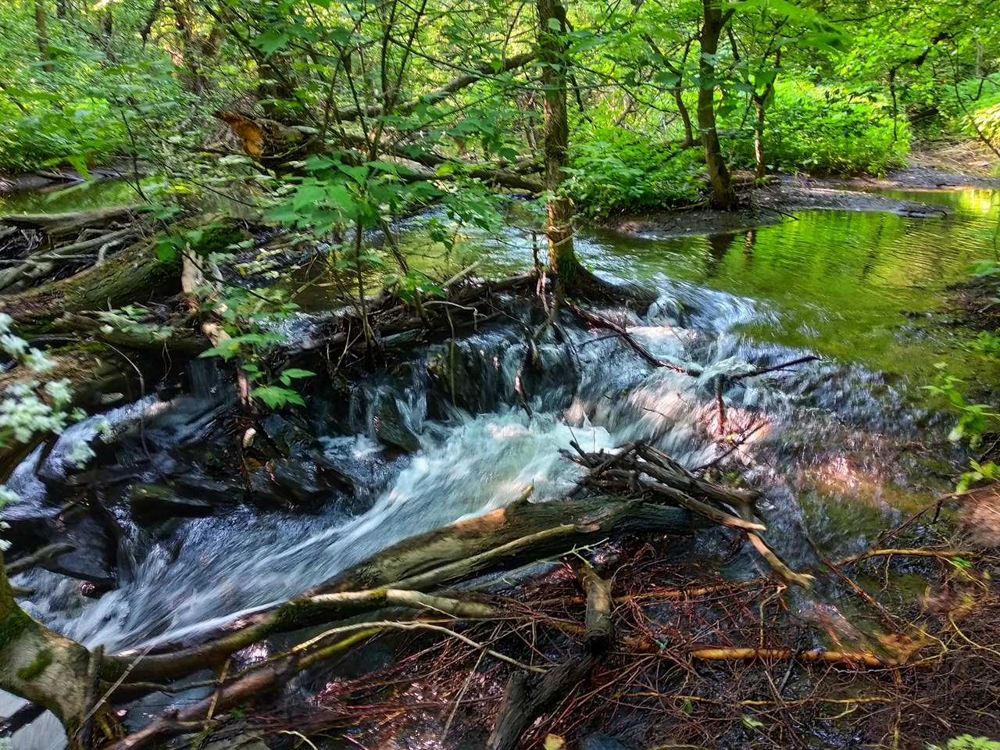

Располагается западнее Ящиково вдоль балки и р. Белая. По сути - это выступающие скалы из грунтов и не представляет никакого интереса. Я не знаю, что нужно курить чтобы там рассмотреть какие-то лица. Водопад, который находится в балке по большей части состоит из говна, палок и комаров.

Не рекомендую данную локацию. 

