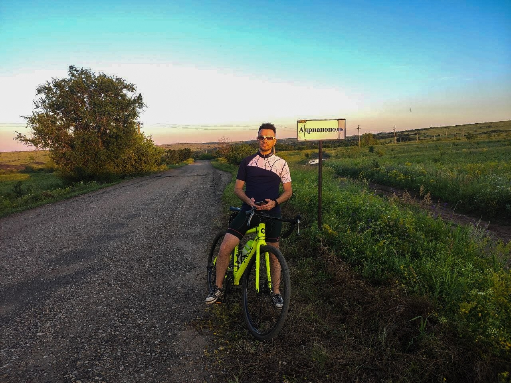

Село Адрианополь, которое находится южнее Ящиково, рядом с истоком р. Белая, с насилием 446 жителей на 2001г.   На сегодняшний день наверное нет и половины. Единственная дорога ведущая  к селу разбита. Само село имеет две улицы, дорога естественно шлаковая, а кое-где и вовсе грунтовая. Из достопримечательностей в селе есть Свято-Николаевский храм. На сегодняшний день село вымирает, дома неухоженные, много брошенных домов и сельскохозяйственной техники. Из местных видел только мужика сидевшего на лавочке по ул. Ленина и на обратном пути увязался дед на велосипеде расспрашивая откуда приехал я.

