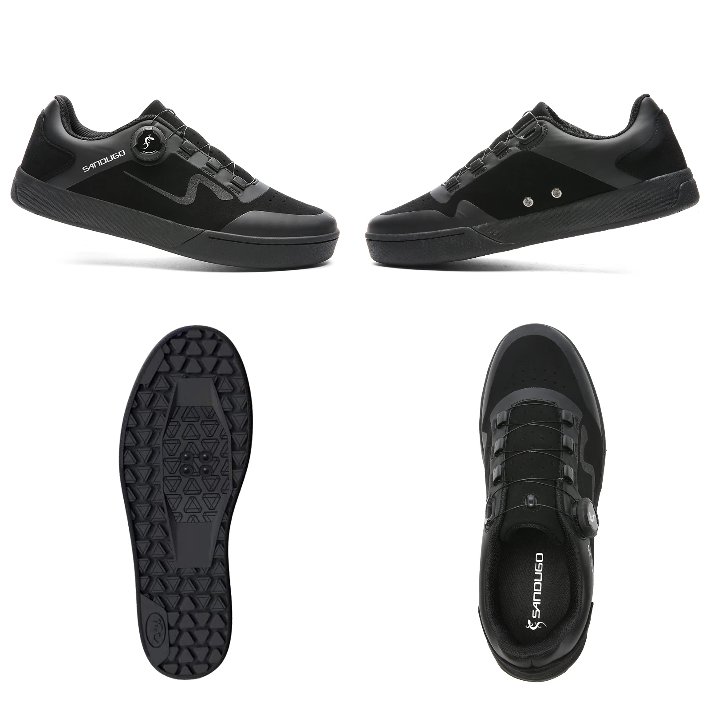
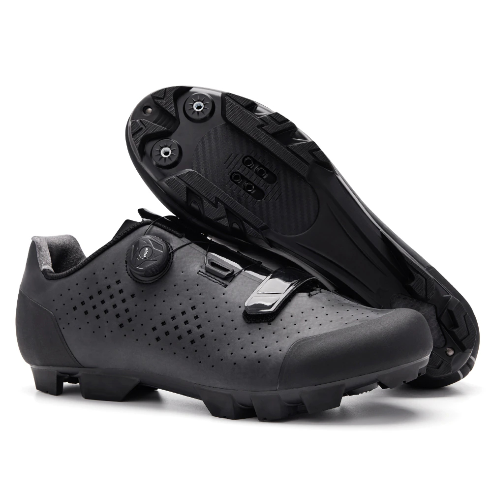

Решил перейти на контактные педали и стал выбор выбора обуви, так как не знал буду ли в целом использовать их, заказал себе педали Rockbros гибрид под контакты и тапталки. 

Когда начал выбирать обувь, был в растерянности. На AliExpress огромный выбор обуви.  Остановил своей выбор на двух фирмах Santic и Sandugo. 

У Sandugo обувь выполнена в спортивном стиле под кроссовки с плоской подошвой, на мой взгляд она больше межсезонная, летом в ней будет жарко.  

Выполнены из дышащего материала поверхности обуви Synthetic, подкладки LYCRA , подошвы резина. BOA работает хорошо, для того чтобы затянуть, нужно повернуть по часовой стрелки, а растянуть против до щелчка. 
Santic много различной обуви я взял модель на лето с большим количеством отверстий.

Выполнены из дышащего материала, верх Полиуретан, подкладка Synthetic, подошва TPR. BOA работает аналогично. В комплекте идут 4шипа и ключ, которые накручиваются по желанию на носок. Шипы для педалей в комплекте не идут. За счет поднятого носка, ходить в них на много удобнее.

За свои деньги туфли выполнены качественно, рекомендую для покупки.